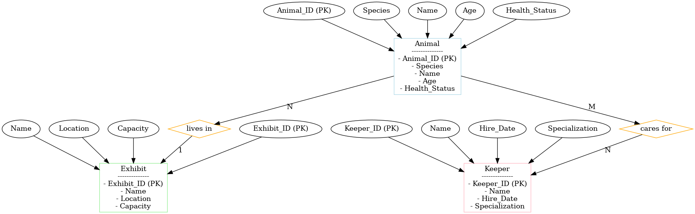

# HW4
HW 4
(Due 2/17)
Part 1 (50 points): Normalization and Standardization 
Take the iris data set and create two new .csv data sets (25 points each). One that normalizes all columns to have values between 0 and 1 and a second that standardizes all columns to have a mean of 0 and standard deviation of 1.
Push both files to github. 

Part 2 (50 points): ER Diagram 
Create an ER diagram that models a zoo:
Define at least three entities that have several attributes for each entity, their relationship between entities, and their constraints. Argue your decisions. You will graded based on your explanation on why you chose certain constraints. 
What to submit 
Either create a markdown readme file that has a copy of your ER diagram and explanation or .pdf version and push that to github.
Please also submit a link to your github submission to Canvas as well. This helps the TA grade faster. 

---
# 🐾 Zoo ER Diagram

## 📖 Introduction
This project presents the Entity-Relationship (ER) diagram for a zoo management system.  
The system incudes three core entities, their attributes, relationships, and constraints.

---

## 🖼️ ER Diagram

---

## 🔍 Entity Descriptions

### 🐘 1️⃣ Animal  
- **Primary Key**: `Animal_ID`  
- **Attributes**:  
  - `Animal_ID`: Unique identifier for each animal.  
  - `Species`: The animal's species.  
  - `Name`: The animal's name.  
  - `Age`: The animal's age (in years).  
  - `Health_Status`: The animal's health status.  
- **Constraints**:  
  - `Animal_ID` must be unique.  
  - `Species` cannot be null.  
  - `Age` must be a non-negative integer.  

**Design Rationale**:  
- `Animal` is the core entity of the zoo management system.  
- `Health_Status` helps track medical conditions.  

---

### 🏞️ 2️⃣ Exhibit  
- **Primary Key**: `Exhibit_ID`  
- **Attributes**:  
  - `Exhibit_ID`: Unique identifier for each exhibit.  
  - `Name`: The exhibit's name.  
  - `Location`: The exhibit's location.  
  - `Capacity`: Maximum number of animals the exhibit can accommodate.  
- **Constraints**:  
  - `Exhibit_ID` must be unique.  
  - `Capacity` must be a positive integer.  

**Design Rationale**:  
- Exhibits organize animals by habitat.  
- `Capacity` ensures no overcrowding.  

---

### 🧑‍🌾 3️⃣ Keeper  
- **Primary Key**: `Keeper_ID`  
- **Attributes**:  
  - `Keeper_ID`: Unique identifier for each keeper.  
  - `Name`: The keeper's name.  
  - `Hire_Date`: The keeper's employment date.  
  - `Specialization`: The keeper's specialization.  
- **Constraints**:  
  - `Keeper_ID` must be unique.  
  - `Name` cannot be null.  
  - `Hire_Date` must not be a future date.  

**Design Rationale**:  
- Keepers are essential for animal care.  
- `Specialization` helps assign tasks efficiently.  

---

## 🔗 Relationship Descriptions

### 🏡 1️⃣ Animal - Exhibit (1:N)  
- **Relationship Name**: `lives in`.  
- **Description**: Each animal is assigned to exactly one exhibit, and each exhibit can have multiple animals.  
- **Cardinality**: **1:N**.  

**Design Rationale**:  
- Reflects spatial management within the zoo.  

---

### 🤝 2️⃣ Animal - Keeper (M:N)  
- **Relationship Name**: `cares for`.  
- **Description**: Each animal can have multiple keepers, and each keeper can manage multiple animals.  
- **Cardinality**: **M:N**.  
- **Intermediate Table**: `Animal_Keeper` with fields:  
  - `Animal_ID` (FK)  
  - `Keeper_ID` (FK)  
  - `Assignment_Date`  

**Design Rationale**:  
- Captures the collaborative care structure between animals and keepers.  

---

## ⚖️ Design Rationale

- **Entity Selection**: Animals, exhibits, and keepers cover zoo operations.  
- **Attribute Selection**: Attributes support animal care and management.  
- **Relationship Selection**: `lives in` and `cares for` represent key interactions.  
- **Constraints**: Ensure data consistency and prevent errors.  

---
